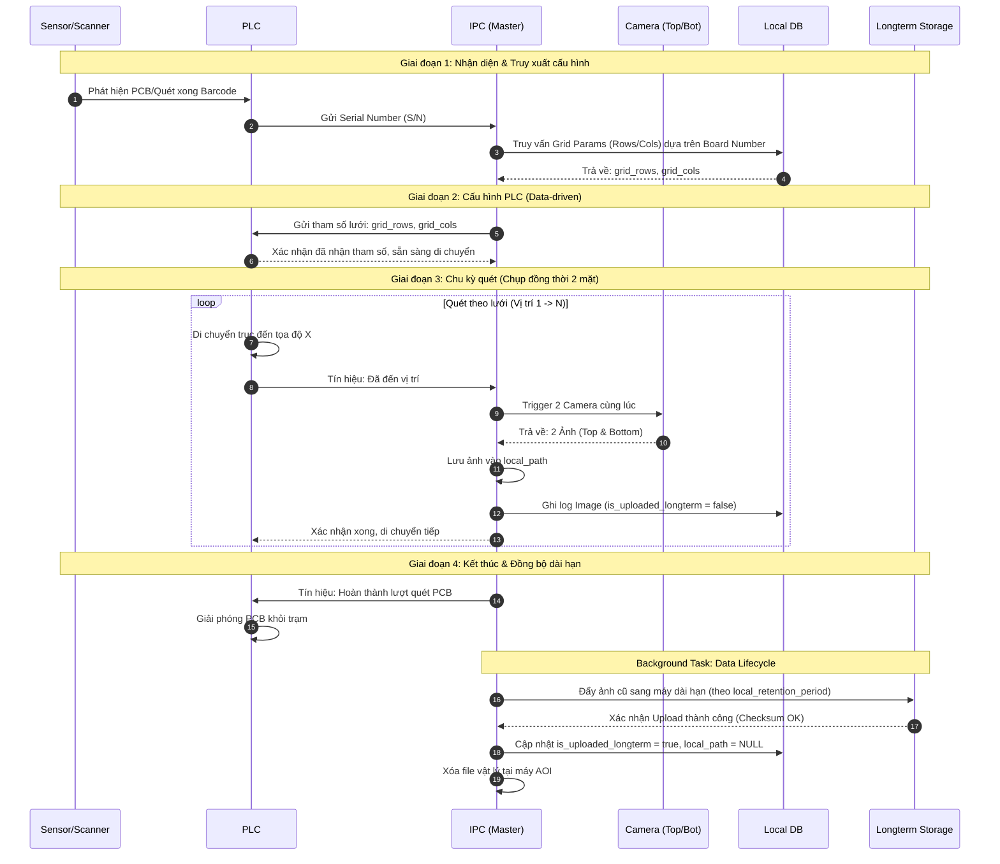

# Kiến trúc Hệ thống và Luồng vận hành AOI (IPC Master)

[TOC]

---

## 1. Tổng quan hệ thống (System Overview)

Trong kiến trúc này, **IPC (Industrial PC)** đóng vai trò là bộ điều khiển trung tâm (Master Controller). Mọi trình tự vận hành từ khởi động, kiểm tra sản phẩm đến quản lý vòng đời dữ liệu đều do IPC điều phối.

### Các thành phần chính:
1.  **IPC (Master)**: Chạy ứng dụng điều khiển chính, xử lý ảnh và quản lý Database.
2.  **Local DB (PostgreSQL)**: Lưu trữ tại chỗ thông tin đơn hàng, kết quả quét và cấu hình.
3.  **Longterm Storage (MinIO/Server)**: Hệ thống lưu trữ dài hạn, dùng để lưu trữ ảnh sau khi đã nén hoặc lưu trữ lịch sử.
4.  **Hardware**: PLC (Điều khiển cơ cấu), 2 Camera (Top/Bottom), Scanner (Barcode).

---

## 2. Luồng vận hành chi tiết (Operation Workflow)

Sơ đồ dưới đây mô tả trình tự khi một bo mạch (PCB) đi vào trạm kiểm tra, áp dụng cơ chế **Data-driven** (IPC gửi tham số lưới quét trực tiếp cho PLC).

---

## 3. Các bước thực hiện chi tiết

### Bước 1: Nhận diện sản phẩm & Lấy cấu hình
- Khi cảm biến phát hiện PCB, Scanner sẽ đọc S/N.
- IPC nhận S/N, truy vấn thông tin `Board Number` và `Order Number` tương ứng.
- IPC lấy các tham số lưới quét `grid_rows` và `grid_cols` từ bảng `board_numbers` trong Local DB.

### Bước 2: Điều khiển PLC (Data-driven Approach)
- Thay vì PLC chọn chương trình cứng, IPC sẽ ghi trực tiếp các tham số `grid_rows` và `grid_cols` vào các thanh ghi (Registers) của PLC.
- Điều này cho phép hệ thống AOI hỗ trợ loại mạch mới mà không cần sửa đổi code PLC/HMI.

### Bước 3: Chu kỳ kiểm tra (Dual Camera Capture)
- PLC di chuyển các trục theo lưới quét. Tại mỗi điểm dừng, PLC gửi tín hiệu cho IPC.
- IPC kích hoạt cả 2 camera (Top và Bottom) chụp đồng thời.
- Ảnh được lưu vào đường dẫn cục bộ (`local_path`) trên ổ SSD của máy AOI để đảm bảo tốc độ hiển thị UI nhanh nhất.
- Một bản ghi được tạo trong bảng `images` với trạng thái `is_uploaded_longterm = false`.

### Bước 4: Quản lý vòng đời dữ liệu (Data Lifecycle)
- **Đồng bộ**: Một tiến trình chạy ngầm sẽ kiểm tra các ảnh có thời gian lưu trú vượt quá `local_retention_period` (cấu hình trong bảng `system_configs`).
- **Xác thực**: IPC đẩy ảnh sang máy lưu trữ dài hạn (Longterm Storage). Quá trình này bắt buộc phải có bước kiểm tra **Checksum (MD5/SHA)** để đảm bảo file không bị lỗi khi truyền qua mạng.
- **Dọn dẹp**: Khi nhận được tín hiệu thành công từ máy dài hạn, IPC sẽ:
    1. Cập nhật `is_uploaded_longterm = true`.
    2. Lưu đường dẫn mới vào `longterm_path`.
    3. Xóa file ảnh tại máy AOI và đặt `local_path = NULL` để giải phóng dung lượng SSD.

---

## 4. Quy tắc đặt tên và Cấu trúc thư mục
- **Local Path**: `D:/Images/Order_Number/SN/Side/Row_Col.jpg`
- **Longterm Path**: `http://storage-server:9000/archive/Order_Number/SN/Side/Row_Col.jpg`
- **Quy ước trạng thái**:
    - `is_synced_server`: Trạng thái gửi kết quả text lên hệ thống nhà máy.
    - `is_uploaded_longterm`: Trạng thái gửi file ảnh lên hệ thống lưu trữ dài hạn.
