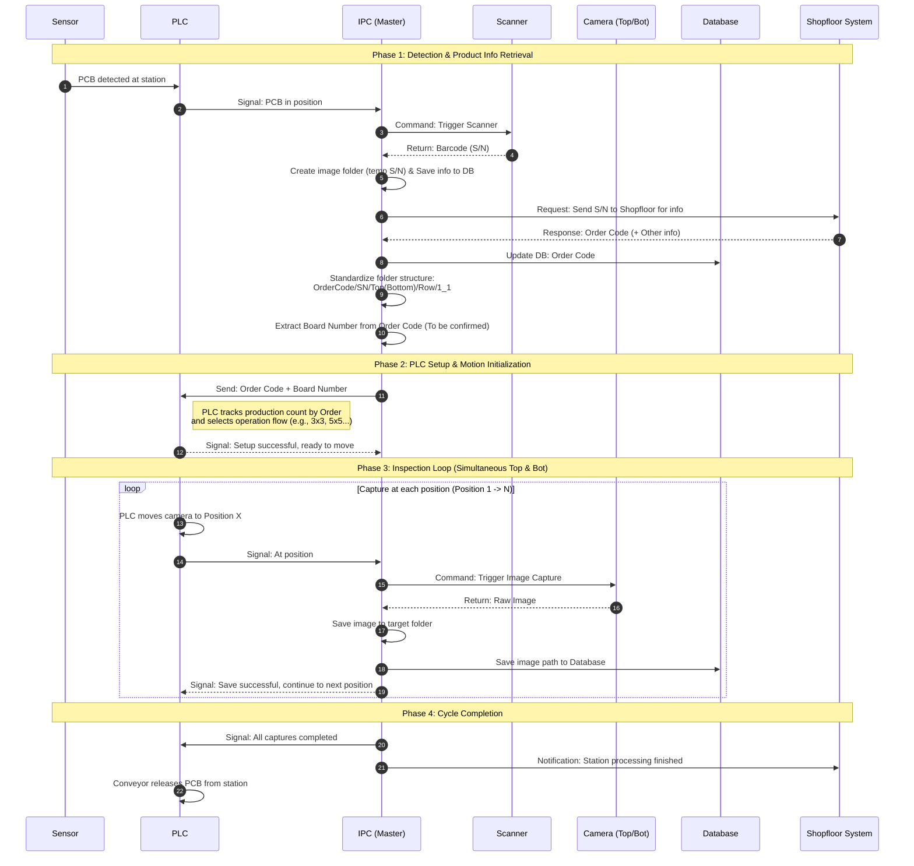

# Control Architecture and AOI Operational Workflow (IPC Master)

[TOC]

---

## 1. System Overview
In this architecture, the **IPC (Industrial PC)** serves as the central controller (Master Controller). The entire sequence of operations, from system startup to product inspection, is coordinated by the IPC.

### IPC Tasks during System Startup
As soon as the computer and hardware devices are powered on, the IPC must perform a system-wide status check (Health Check / Status Check):
1.  **PLC Connection**: Verify communication to ensure the PLC responds and is ready to receive commands.
2.  **Camera Connection**: Initialize connections with the Camera system (Top & Bottom) and ensure capture triggers are functional.
3.  **Scanner Connection**: Check the status of the Barcode Scanner to ensure it is ready to receive trigger commands.
4.  **HMI Status**: Confirm that the HMI control interface has loaded successfully and is ready for user interaction.
5.  **System Connectivity**: Verify the status of the local Database and the connection to the Shopfloor System.
=> **Only when the IPC receives an OK status from all components** will the system switch to **Ready** mode to accept the first PCB.

---

## 2. Operation Workflow

Below is the detailed operational flow coordinated by the IPC when a Printed Circuit Board (PCB) enters the inspection station.

> **Note**: This is a draft workflow and will require further review/confirmation with the software and automation teams (especially regarding the logic for extracting Order Codes and Board Numbers from the Shopfloor system).

### Detailed Execution Steps:

1. **Product Detection**: An optical sensor at the station detects the incoming PCB. The PLC receives this signal, stops the conveyor, and notifies the IPC.
2. **Barcode Scanning**: The IPC immediately commands the barcode scanner to read the Serial Number (S/N) of the PCB.
3. **Shopfloor Synchronization & Folder Organization**:
   - The IPC prepares an initial image storage folder and records the entry in the Database.
   - The IPC sends a request containing the S/N to the Shopfloor system to query the `Order Code` (the Order Code is guaranteed to be returned automatically, no manual entry).
   - Upon receiving info from the Shopfloor, the IPC updates the Database and standardizes the image storage path using the structure: `Order Code / S/N / Capture Side (Top-Bottom) / Row / Coordinate (1_1)`.
4. **PLC Configuration**: 
   - The IPC sends the `Order Code` and `Board Number` to the PLC. (The Board Number may be extracted from the Order Code).
   - The PLC uses this information to track the product count for the batch (Order) and decide the execution script (e.g., 3x3 or 5x5 grid capture).
   - Once the program is selected, the PLC sends a "Setup Successful" response back to the IPC.
5. **Inspection Loop**:
   - The PLC begins moving the axes carrying the Cameras (both Top and Bottom).
   - When reaching the first capture coordinate, the PLC sends a signal to the IPC.
   - The IPC commands the Cameras to capture images.
   - The Cameras return the images, and the IPC saves the files to the target folder and records the paths in the local Database.
   - Once storage is complete, the IPC responds to the PLC so it can continue to the next position. This process repeats until all points are covered.
6. **Cycle Completion**: After scanning all coordinates, the IPC sends a completion signal to the PLC (to release the PCB) and simultaneously sends a status report to the Shopfloor.
