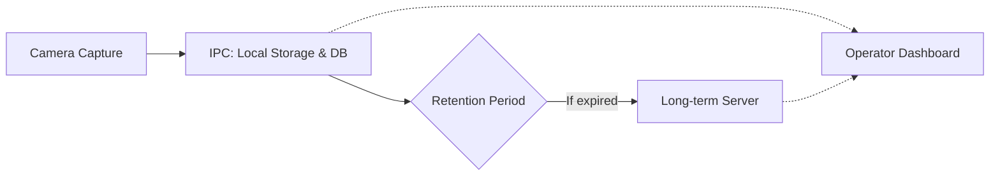

# AOI System: Data Lifecycle & Synchronization Flow

This document describes the high-level process of how inspection images and metadata are captured, stored locally, and eventually synchronized to long-term storage while remaining accessible to the operator.

## 1. Flow Diagram

## 1. Simplified Data Flow

## 2. Process Summary

1.  **Capture**: Camera takes pictures and saves them to the **IPC** (Local Disk + Database).
2.  **Storage**: Photos stay on the IPC for a set time (e.g., 30 days) for quick access.
3.  **Archive**: After the set time, photos are automatically moved to the **Long-term Server** to save space on the IPC.
4.  **View**: The **Dashboard** can display photos regardless of whether they are on the IPC or the Server.
