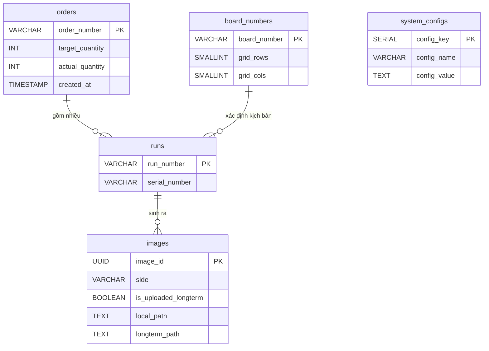

# NTUST AOI — Database Schema Documentation

Hệ thống sử dụng **PostgreSQL** làm cơ sở dữ liệu tại chỗ (Local DB) trên máy AOI để quản lý vận hành và lưu trữ tạm thời trước khi đồng bộ sang hệ thống lưu trữ dài hạn (Longterm Storage).

---

## Phân tích Nghiệp vụ (2 Camera đồng thời)

```
Đơn hàng (Order Number)
└── Mỗi PCB vật lý đi qua (Serial Number)
    └── Một lượt quét (Run Number)
        └── Sinh ra ảnh từ 2 Camera (Top & Bottom)
```

---

## Chi tiết các bảng

### Bảng 1: `orders` (Quản lý đơn hàng)

| Cột | Kiểu dữ liệu | Mô tả |
| :--- | :--- | :--- |
| `order_number` **(PK)** | `VARCHAR(50)` | Mã đơn hàng (ví dụ: `ORD-20240428-001`). |
| `target_quantity` | `INT` | Số lượng bo mạch cần sản xuất. |
| `actual_quantity` | `INT` | Số lượng thực tế đã quét xong (Count từ bảng `runs`). |
| `status` | `VARCHAR(20)` | Trạng thái (`ACTIVE`, `COMPLETED`, `CANCELLED`). |
| `created_at` | `TIMESTAMP` | **Thời điểm tạo bản ghi đơn hàng trên hệ thống.** |

---

### Bảng 2: `board_numbers` (Công thức loại mạch - Recipe)

| Cột | Kiểu dữ liệu | Mô tả |
| :--- | :--- | :--- |
| `board_number` **(PK)** | `VARCHAR(30)` | Mã loại mạch (ví dụ: `BN-5X5`, `BN-7X7`). |
| `grid_rows` | `SMALLINT` | Số hàng trong lưới quét (Gửi xuống PLC). |
| `grid_cols` | `SMALLINT` | Số cột trong lưới quét (Gửi xuống PLC). |
| `created_at` | `TIMESTAMP` | Thời điểm tạo loại mạch. |

---

### Bảng 3: `runs` (Lượt kiểm tra PCB)

| Cột | Kiểu dữ liệu | Mô tả |
| :--- | :--- | :--- |
| `run_number` **(PK)** | `VARCHAR(50)` | Mã lượt chạy (ví dụ: `RUN_20240428_114501`). |
| `serial_number` | `VARCHAR(50)` | S/N của PCB vật lý. |
| `board_number` **(FK)** | `VARCHAR(30)` | Tham chiếu tới `board_numbers`. |
| `order_number` **(FK)** | `VARCHAR(50)` | Tham chiếu tới `orders`. |
| `machine_id` | `VARCHAR(50)` | ID của máy thực hiện kiểm tra. |
| `status` | `VARCHAR(20)` | Trạng thái (`COMPLETED`, `PENDING`). |
| `start_time` | `TIMESTAMP` | Thời điểm bắt đầu quét. |
| `created_at` | `TIMESTAMP` | Thời điểm tạo bản ghi lượt chạy. |

---

### Bảng 4: `images` (Ảnh chụp chi tiết - 2 Camera)

| Cột | Kiểu dữ liệu | Mô tả |
| :--- | :--- | :--- |
| `image_id` **(PK)** | `UUID` | ID định danh duy nhất (tự động tạo). |
| `run_number` **(FK)** | `VARCHAR(50)` | Liên kết tới bảng `runs`. |
| `side` | `VARCHAR(10)` | Mặt bo mạch (`Top` hoặc `Bottom`). |
| `local_path` | `TEXT` | Đường dẫn ảnh tại máy AOI. Sẽ bị xóa (NULL) sau khi đẩy sang máy dài hạn. |
| `longterm_path` | `TEXT` | Đường dẫn ảnh trên máy lưu trữ dài hạn (Longterm Storage). |
| `is_uploaded_longterm` | `BOOLEAN` | Mặc định `false`. Chuyển thành `true` khi đã upload thành công. |
| `row_idx` | `INTEGER` | Vị trí hàng trong lưới. |
| `col_idx` | `INTEGER` | Vị trí cột trong lưới. |
| `condition` | `VARCHAR(10)` | Kết quả (`PASS`, `FAIL`). |
| `file_size_bytes` | `BIGINT` | Dung lượng file ảnh. |
| `capture_time` | `TIMESTAMP` | Thời điểm camera chụp bức ảnh này. |

---

### Bảng 5: `system_configs` (Cấu hình hệ thống)

| Cột | Kiểu dữ liệu | Mô tả |
| :--- | :--- | :--- |
| **`config_key` (PK)** | `SERIAL` | Khóa chính tự động tăng. |
| `config_name` | `VARCHAR(100)` | Tên thông số cấu hình. |
| `config_value` | `TEXT` | Giá trị cài đặt. |
| `unit` | `VARCHAR(20)` | Đơn vị tính (Phút, Ngày, %). |

**Thông số cấu hình quan trọng:**
1.  **`local_retention_period`**: Khoảng thời gian ảnh lưu tại máy Local trước khi đẩy sang máy dài hạn (ví dụ: `30` đơn vị `Ngày`).
2.  **`sync_retry_interval`**: Thời gian thử lại nếu upload sang máy dài hạn thất bại (ví dụ: `5` đơn vị `Phút`).

---

## Sơ đồ quan hệ (ERD)



---

## Quy tắc lưu trữ và Đặt tên File (Naming Convention)

Để đảm bảo tính hệ thống và dễ dàng tra cứu, cấu trúc thư mục và tên file được quy định như sau:

- **Local Storage**: `{local_root}/{order_number}/{serial_number}/{side}/{row}_{col}.jpg`
- **Longterm Storage**: `{longterm_root}/{order_number}/{serial_number}/{side}/{row}_{col}.jpg`

**Ví dụ:**
- Máy AOI: `D:/Images/ORD-001/SN-999/Top/1_1.jpg`
- Máy Dài hạn: `http://192.168.1.100:9000/archive/ORD-001/SN-999/Top/1_1.jpg`
