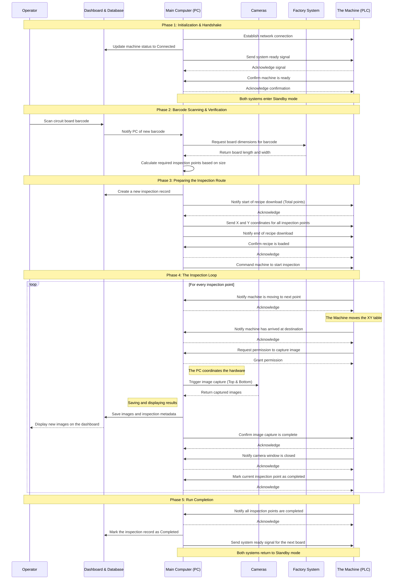

# 🔬 NTUST Automated Optical Inspection (AOI) System

Welcome to the **NTUST AOI** platform. This repository contains an end-to-end industrial solution for PCB inspection. It successfully bridges physical hardware (Mitsubishi FX5U PLCs and dual-camera arrays) with a modern software stack (FastAPI, PostgreSQL, and a real-time React Dashboard).

---

## 🌟 Overview

The AOI system is designed to automate the quality assurance process on the factory floor. By integrating directly with the factory's Manufacturing Execution System (MES), the system verifies Serial Numbers (S/N) in real-time, calculates dynamic inspection paths based on board dimensions, commands the PLC to move the XY-table, and captures high-resolution Top/Bottom images at precise coordinates.

## ⚡ Core Features

- **Direct API Image Injection:** Images are captured by the hardware controller and POSTed directly to the FastAPI backend, eliminating reliance on brittle file-watcher mechanisms.
- **Real-Time UI Updates:** PostgreSQL `NOTIFY` triggers and WebSockets push new inspection images instantly to the React frontend.
- **Industrial PLC Integration:** Communicates with Mitsubishi PLCs using the robust SLMP (Seamless Message Protocol) with guaranteed event acknowledgments to prevent timeouts.
- **Factory MES Sync:** Pulls board dimensions and manufacturing orders dynamically.
- **Headless & GUI Modes:** Can be run via a PySide6 Desktop GUI or entirely headless for CI/CD and automated server environments.

---

## 🔄 System Architecture & Workflow

The system relies on strict state synchronization between the PC Controller, the Database, and the Machine (PLC).



---

## 🚀 Quick Start (Local Simulation)

You can run the entire system on a standard PC without any industrial hardware. The system includes built-in simulators for both the PLC and the factory MES.

### Prerequisites
1. **Python 3.10+**
2. **Node.js 18+**
3. **Docker Desktop** (Required for PostgreSQL)

### Step 1: Install Dependencies
```bash
# Install Python backend dependencies
pip install -r requirements.txt

# Install React frontend dependencies
cd NTUST-AOI-UI
npm install
cd ..
```

### Step 2: Start the System
You can start the entire stack (Database, API, Frontend, and PC Controller) using the headless runner:
```bash
python headless_runner.py start
```

### Step 3: Add Mock Images (Optional but Recommended)
During a simulated run, the system will randomly select PCB images to act as the camera output.
1. Create a folder named `mock_images` in the root directory.
2. Place a few `.jpg` or `.png` images inside it.
3. If this folder is empty or missing, the system will generate fake placeholder image files instead.

### Step 4: Access the Dashboard
Open your browser and navigate to: **http://localhost:3001**

Input a mock Serial Number (e.g., `SN24_TEST`) to initiate a simulated inspection run.

To shut down the system and clean up background processes, run:
```bash
python headless_runner.py stop
```

---

## 🏭 Industrial Deployment

If you are deploying this system to the actual factory floor (connecting to the physical FX5U PLC and real GigE Cameras), please refer to our detailed step-by-step deployment guide:

👉 [**Real Hardware Integration Guide**](docs/deployment/REAL_HARDWARE_INTEGRATION.md)

---

## 📂 Documentation & AI Onboarding

For comprehensive technical details, please refer to the following documents:

- **[ARCHITECTURE.md](ARCHITECTURE.md)**: Full technical architecture, tech stack, schema, protocols — read this first.
- **[Database Schema](docs/reference/DATABASE_SCHEMA.md)**: Complete PostgreSQL schema with all 7 tables, triggers, NOTIFY channels, and API mapping.
- **[System Workflows](docs/reference/WORKFLOWS.md)**: Sequence diagrams for operational states and inspection cycle.
- **[Production Deployment](docs/deployment/PRODUCTION_DEPLOYMENT_ARCHITECTURE.md)**: Target production build plan (Windows Services + Electron).

*Note for AI Agents: Always read `.agents/AGENTS.md` and `ARCHITECTURE.md` before executing any refactoring tasks within this repository.*
