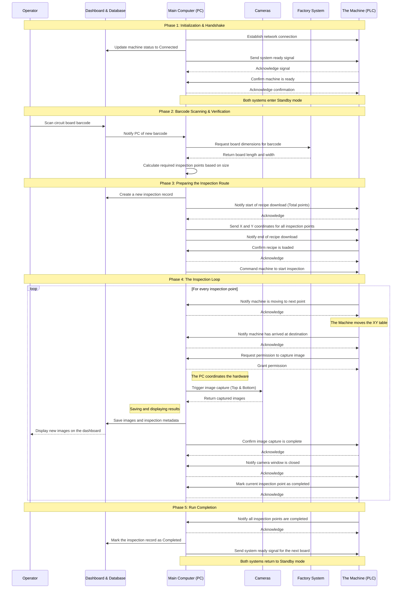

# 🔬 NTUST Automated Optical Inspection (AOI) System

Welcome to the **NTUST AOI** platform. This repository contains an end-to-end industrial solution for PCB inspection. It successfully bridges physical hardware (Mitsubishi FX5U PLCs and dual-camera arrays) with a modern software stack (FastAPI, PostgreSQL, and a real-time React Dashboard).

---

## 🌟 Overview

The AOI system is designed to automate the quality assurance process on the factory floor. By integrating directly with the factory's Manufacturing Execution System (MES), the system verifies Serial Numbers (S/N) in real-time, calculates dynamic inspection paths based on board dimensions, commands the PLC to move the XY-table, and captures high-resolution Top/Bottom images at precise coordinates.

## ⚡ Core Features

- **Direct API Image Injection:** Images are captured by the hardware controller and POSTed directly to the FastAPI backend, eliminating reliance on brittle file-watcher mechanisms.
- **Real-Time UI Updates:** PostgreSQL `NOTIFY` triggers and WebSockets push new inspection images instantly to the React frontend.
- **Industrial PLC Integration:** Communicates with Mitsubishi PLCs using the robust SLMP (Seamless Message Protocol) with guaranteed event acknowledgments to prevent timeouts.
- **Factory MES Sync:** Pulls board dimensions and manufacturing orders dynamically.
- **Headless & GUI Modes:** Can be run via a PySide6 Desktop GUI or entirely headless for CI/CD and automated server environments.

---

## 🔄 System Architecture & Workflow

The system relies on strict state synchronization between the PC Controller, the Database, and the Machine (PLC).



---

## 🚀 Quick Start (Local Simulation)

You can run the entire system on a standard PC without any industrial hardware.
The system includes built-in simulators for the PLC and the factory MES.

### Prerequisites
1. **Conda environment `aoi_env`** — Python 3.10+
2. **Node.js 18+**
3. **PostgreSQL 18** (Native installation via .exe on Windows or Homebrew on macOS)

### Step 1: Set Up Environment
```bash
conda activate aoi_env
python tasks.py setup         # Installs Python + Node dependencies
```

### Step 2: Database Setup
1. Install PostgreSQL 18 natively on your machine and start the service.
2. Open `psql` or pgAdmin.
3. Create a user `admin` and a database `pcb_aoi_db`.
4. Run the initialization script `ntust_aoi_pcb_db/sql/init.sql` to create tables.

### Step 3: Configure Environment
```bash
cp .env.example .env          # Then edit .env with your DB credentials
```

### Step 4: Start the System
```bash
python tasks.py start         # Starts FastAPI + UI + all simulators
```

Internally calls `python headless_runner.py start`.

### Step 5: Add Mock Images (Optional but Recommended)
During a simulated run, the system selects PCB images from `mock_images/` as camera output.
Create the folder and place a few `.jpg` or `.png` images inside it.
If empty or missing, the system generates placeholder files automatically.

### Step 6: Access the Dashboard
Open your browser: **http://localhost:3001**

Input a mock Serial Number (e.g., `SN24_TEST`) to start a simulated inspection run.

### Stop the System
```bash
python tasks.py stop          # Stops all services cleanly
```

---

## 🛠️ Python Tasks Command Reference

```bash
python tasks.py setup       # Install all dependencies (first time)
python tasks.py start       # Start full system
python tasks.py stop        # Stop all services
python tasks.py restart     # Stop + start
python tasks.py test        # Run E2E integration test (system must be running)
python tasks.py git-check   # Pre-work safety check (branch, status, conflicts)
python tasks.py update-docs # Show which docs need updating based on git changes
```

---

## 🏭 Industrial Deployment

If you are deploying to the actual factory floor (physical FX5U PLC and GigE cameras),
refer to the hardware switchover guide:

👉 [**Real Hardware Integration Guide**](docs/deployment/REAL_HARDWARE_INTEGRATION.md)

---

## 📂 Documentation & AI Onboarding

| Document | Purpose |
|---|---|
| [ARCHITECTURE.md](ARCHITECTURE.md) | System overview, topology, routing to module docs |
| [machine_control/ARCHITECTURE.md](machine_control/ARCHITECTURE.md) | PLC protocol, camera protocol, MES integration |
| [ntust_aoi_pcb_db/ARCHITECTURE.md](ntust_aoi_pcb_db/ARCHITECTURE.md) | DB schema, real-time pipeline, API endpoints |
| [NTUST-AOI-UI/ARCHITECTURE.md](NTUST-AOI-UI/ARCHITECTURE.md) | Component tree, WebSocket flow |
| [docs/reference/DATABASE_SCHEMA.md](docs/reference/DATABASE_SCHEMA.md) | Full PostgreSQL column-level schema |
| [docs/reference/WORKFLOWS.md](docs/reference/WORKFLOWS.md) | Operational state sequence diagrams |
| [docs/GIT_WORKFLOW.md](docs/GIT_WORKFLOW.md) | Branch naming, merge conflict protocol |
| [docs/deployment/PRODUCTION_DEPLOYMENT_ARCHITECTURE.md](docs/deployment/PRODUCTION_DEPLOYMENT_ARCHITECTURE.md) | Production build plan |

*AI Agents: Read `.agents/AGENTS.md` first. It contains all constraints and routing links.*
