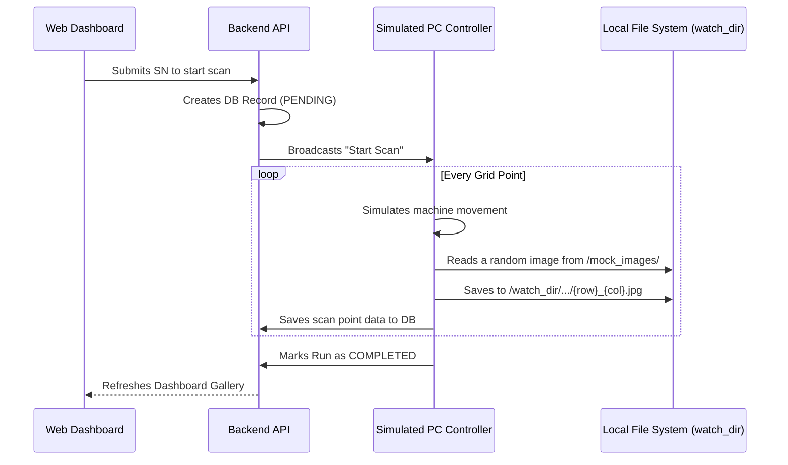

# 🔬 NTUST AOI System

Welcome to the **NTUST Automated Optical Inspection (AOI)** platform. This repository contains a complete industrial solution for PCB inspection, bridging physical PLCs, dual-camera arrays, a robust PostgreSQL database engine, and a modern React-based HMI dashboard.

---

## 🚀 Quick Start Guide (Testing via Simulation)

If you just want to run the system on your personal computer without any physical industrial hardware, you can use our built-in simulation tools.

### Prerequisites
1. **Python 3.10+**: Make sure Python is installed.
2. **Node.js 18+**: Required for the frontend dashboard.
3. **Docker Desktop**: Must be running to host the PostgreSQL database.

### Step 1: Installation
1. Clone this repository to your local machine.
2. Open a terminal in the root directory.
3. Install the Python dependencies:
   ```bash
   pip install -r requirements.txt
   ```
4. Install the Frontend dependencies:
   ```bash
   cd NTUST-AOI-UI
   npm install
   cd ..
   ```

### Step 2: Start the System Core (Launcher)
The AOI system uses a Desktop Launcher to manage all background services (Database, Backend API, Frontend UI, and PC Controller).
1. Ensure **Docker Desktop** is open and running.
2. Run the launcher script:
   ```bash
   python launcher.py
   ```
3. A desktop GUI will appear. Click the **"Start All"** button. This will automatically:
   - Spin up the PostgreSQL Docker container.
   - Start the FastAPI backend server (`http://localhost:8000`).
   - Start the Vite React Frontend (`http://localhost:3001`).
   - Start the `pc_controller.py` service.

### Step 3: Start the Hardware Simulators
Open a *new* terminal window, navigate to the simulation folder, and start the PLC simulator. This script mocks a Mitsubishi SLMP PLC.
```bash
cd simulation
python plc_sim.py
```
*(Note: The camera is automatically simulated by `pc_controller.py` if no real camera SDK is found).*

### Step 4: Add Mock Images (Optional but Recommended)
The simulated camera (`pc_controller.py`) tries to pull realistic images during the scan. 
1. Create a folder named `mock_images` in the root directory.
2. Place a few `.jpg` or `.png` PCB images inside it.
3. During the simulated run, the system will randomly pick images from `mock_images` and save them as the "scanned" results. If the folder is empty, it will generate fake empty files instead.

### Step 5: Access the Dashboard & Run
Open your web browser and go to: **http://localhost:3001**

You are now running the full AOI system in simulation mode. Input a Serial Number to start!

---

## 🔄 Simulation Data Flow & Sequence Diagram

When running in simulation mode, the data generation and storage follow a specific pipeline to mimic the real hardware.

**Folder Structure Generation:**
When a scan completes a point, the simulated camera saves the image to the local "Watch Directory" following this structure:
`watch_dir/{Manufacturing_Order}/{Serial_Number}/{Run_Code}/{Top_or_Bottom}/{run_code}_{side}_r{row}_c{col}.jpg`



---

## 🏭 Industrial Deployment (Real Hardware Integration)

Deploying the system onto an actual Industrial PC (IPC) connected to physical PLCs and GigE Cameras requires network configuration and environment variable adjustments.

### Step 1: Network Configuration
1. Ensure your IPC has a static IP address on the same subnet as the PLC and Cameras (e.g., `192.168.1.xxx`).
2. Verify you can `ping` the PLC's IP address from the IPC.

### Step 2: Configure Environment Variables
In the root directory of this repository, create or edit the `.env` file to match your factory floor settings:

```ini
# PLC Configuration
PLC_HOST=192.168.1.100     # The actual IP of the Mitsubishi PLC
PLC_PORT=5002              # SLMP TCP Port
PLC_NETWORK_NO=0
PLC_PC_NO=255

# Camera Configuration
CAMERA_TOP_ID=CAM_T_001
CAMERA_BOTTOM_ID=CAM_B_001
USE_REAL_CAMERA=true       # Set to true to bypass simulation and use the real SDK

# Database Configuration
POSTGRES_USER=aoi_user
POSTGRES_PASSWORD=aoi_pass
POSTGRES_DB=ntust_aoi_db
```

### Step 3: Implement Camera SDK
Out of the box, `pc_controller.py` uses a dummy camera class (`DummyCameraSDK`). To integrate your physical cameras:
1. Open `machine_control/pc_controller.py`.
2. Locate the `RealCameraSDK` class.
3. Replace the placeholder `start()`, `stop()`, and `save_latest()` methods with the actual Python SDK commands provided by your camera manufacturer (e.g., PyPylon for Basler cameras, or Spinnaker for FLIR cameras).

### Step 4: Launching
Run the system exactly as you would in simulation mode:
```bash
python launcher.py
```
Click **"Start All"**. The `pc_controller` will read the `.env` file, connect to the physical PLC at `192.168.1.100`, initialize the real cameras, and wait for commands from the Web UI.

---

## 📂 Project Documentation

Deepen your understanding of the system's architecture and logic by reading the internal documentation:

- [**System Workflows**](docs/EN/WORKFLOWS.md): Detailed explanations of what happens when entering new, duplicate, or failed Serial Numbers.
- [**Database Schema**](docs/EN/DATABASE_SCHEMA.md): Complete breakdown of the PostgreSQL tables and entity relationships.

---

## 🛠 Tech Stack Overview
- **HMI Frontend**: React, Vite, Tailwind CSS.
- **Backend API**: Python FastAPI, Uvicorn, Psycopg2.
- **Machine Control**: Python SLMP (Mitsubishi PLC protocol), Socket programming.
- **Database**: PostgreSQL (Dockerized).
