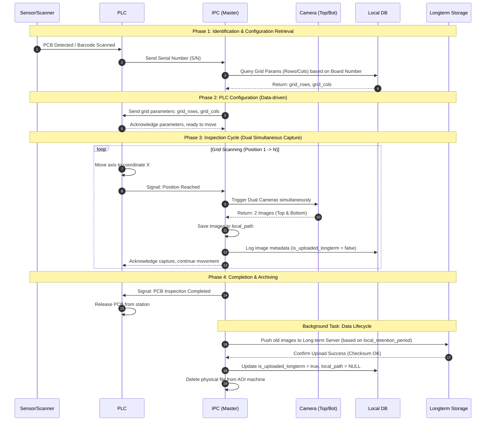

# AOI System Architecture and Operation Flow (IPC Master)

[TOC]

---

## 1. System Overview

In this architecture, the **IPC (Industrial PC)** acts as the **Master Controller**. All operational sequences, from startup and product inspection to data lifecycle management, are coordinated by the IPC.

### Key Components:
1.  **IPC (Master)**: Runs the main control application, processes images, and manages the database.
2.  **Local DB (PostgreSQL)**: Locally stores order information, scan results, and system configurations.
3.  **Long-term Storage (MinIO/Server)**: Archive system used for long-term image storage after compression or for historical records.
4.  **Hardware**: PLC (Mechanism Control), Dual Cameras (Top/Bottom), and Barcode Scanner.

---

## 2. Operation Workflow

The diagram below describes the sequence when a Printed Circuit Board (PCB) enters the inspection station, utilizing a **Data-driven** mechanism (IPC sends grid parameters directly to the PLC).

---

## 3. Detailed Operational Steps

### Step 1: Identification & Recipe Retrieval
- When the sensor detects a PCB, the scanner reads the S/N.
- The IPC receives the S/N and queries the corresponding `Board Number` and `Order Number`.
- The IPC retrieves the scanning grid parameters (`grid_rows` and `grid_cols`) from the `board_numbers` table in the Local DB.

### Step 2: PLC Control (Data-driven Approach)
- Instead of the PLC using a hardcoded program, the IPC writes the `grid_rows` and `grid_cols` parameters directly into the PLC's registers.
- This allows the AOI system to support new board types without modifying the PLC or HMI code.

### Step 3: Inspection Cycle (Dual Camera Capture)
- The PLC moves the axes according to the scan grid. At each stop, the PLC signals the IPC.
- The IPC triggers both cameras (Top and Bottom) simultaneously.
- Images are saved to the local path (`local_path`) on the AOI machine's SSD to ensure the fastest UI rendering speed.
- A record is created in the `images` table with the status `is_uploaded_longterm = false`.

### Step 4: Data Lifecycle Management
- **Synchronization**: A background process checks for images whose stay duration exceeds the `local_retention_period` (configured in the `system_configs` table).
- **Verification**: The IPC pushes images to the Long-term Storage server. This process requires a **Checksum (MD5/SHA)** verification step to ensure file integrity during network transmission.
- **Cleanup**: Upon receiving a success signal from the storage server, the IPC will:
    1. Update `is_uploaded_longterm = true`.
    2. Store the new remote path in `longterm_path`.
    3. Delete the local image file and set `local_path = NULL` to free up SSD space.

---

## 4. Naming Conventions & Directory Structure
- **Local Path**: `D:/Images/Order_Number/SN/Side/Row_Col.jpg`
- **Long-term Path**: `http://storage-server:9000/archive/Order_Number/SN/Side/Row_Col.jpg`
- **Status Constants**:
    - `is_synced_server`: Status of uploading text results to the factory MES system.
    - `is_uploaded_longterm`: Status of uploading image files to the long-term archiving system.
