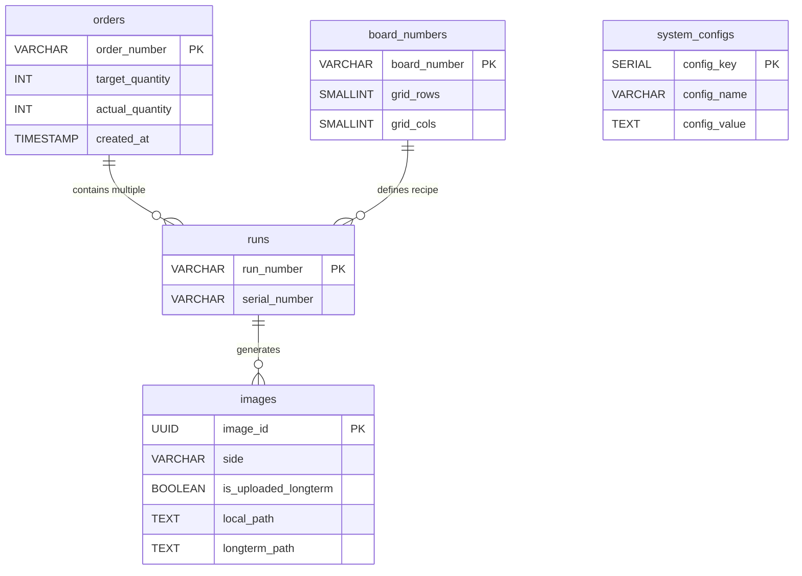

# NTUST AOI — Database Schema Documentation

The system uses **PostgreSQL** as the local database (Local DB) on the AOI machine to manage operations and provide temporary storage before synchronizing data to the long-term archiving system (Long-term Storage).

---

## Business Logic Analysis (Dual Simultaneous Cameras)

```
Order (Order Number)
└── Each physical PCB (Serial Number)
    └── One inspection cycle (Run Number)
        └── Generated images from 2 Cameras (Top & Bottom)
```

---

## Table Details

### Table 1: `orders` (Order Management)

| Column | Data Type | Description |
| :--- | :--- | :--- |
| `order_number` **(PK)** | `VARCHAR(50)` | Unique order ID (e.g., `ORD-20240428-001`). |
| `target_quantity` | `INT` | Target number of PCBs to produce. |
| `actual_quantity` | `INT` | Actual number of PCBs inspected (Count from the `runs` table). |
| `status` | `VARCHAR(20)` | Current state (`ACTIVE`, `COMPLETED`, `CANCELLED`). |
| `created_at` | `TIMESTAMP` | **Timestamp when the order was created in the system.** |

---

### Table 2: `board_numbers` (Board Recipes/Models)

| Column | Data Type | Description |
| :--- | :--- | :--- |
| `board_number` **(PK)** | `VARCHAR(30)` | Board model ID (e.g., `BN-5X5`, `BN-7X7`). |
| `grid_rows` | `SMALLINT` | Number of rows in the inspection grid (sent to PLC). |
| `grid_cols` | `SMALLINT` | Number of columns in the inspection grid (sent to PLC). |
| `created_at` | `TIMESTAMP` | Timestamp when the board model was created. |

---

### Table 3: `runs` (PCB Inspection Cycles)

| Column | Data Type | Description |
| :--- | :--- | :--- |
| `run_number` **(PK)** | `VARCHAR(50)` | Unique run ID (e.g., `RUN_20240428_114501`). |
| `serial_number` | `VARCHAR(50)` | Physical PCB Serial Number (S/N). |
| `board_number` **(FK)** | `VARCHAR(30)` | Reference to the `board_numbers` table. |
| `order_number` **(FK)** | `VARCHAR(50)` | Reference to the `orders` table. |
| `machine_id` | `VARCHAR(50)` | ID of the AOI machine performing the test. |
| `status` | `VARCHAR(20)` | Run status (`COMPLETED`, `PENDING`). |
| `start_time` | `TIMESTAMP` | Timestamp when the scan started. |
| `created_at` | `TIMESTAMP` | Timestamp when the run record was created. |

---

### Table 4: `images` (Detailed Inspection Images - Dual Cameras)

| Column | Data Type | Description |
| :--- | :--- | :--- |
| `image_id` **(PK)** | `UUID` | Unique identifier (automatically generated). |
| `run_number` **(FK)** | `VARCHAR(50)` | Link to the `runs` table. |
| `side` | `VARCHAR(10)` | Board surface (`Top` or `Bottom`). |
| `local_path` | `TEXT` | File path on the local AOI machine. Set to NULL after upload. |
| `longterm_path` | `TEXT` | File path/URL on the long-term archiving system. |
| `is_uploaded_longterm` | `BOOLEAN` | Default is `false`. Set to `true` after successful upload. |
| `row_idx` | `INTEGER` | Row position in the scanning grid. |
| `col_idx` | `INTEGER` | Column position in the scanning grid. |
| `condition` | `VARCHAR(10)` | Inspection result (`PASS`, `FAIL`). |
| `file_size_bytes` | `BIGINT` | Image file size in bytes. |
| `capture_time` | `TIMESTAMP` | Timestamp when the camera captured the image. |

---

### Table 5: `system_configs` (System Configurations)

| Column | Data Type | Description |
| :--- | :--- | :--- |
| **`config_key` (PK)** | `SERIAL` | Auto-incrementing primary key. |
| `config_name` | `VARCHAR(100)` | Name of the configuration parameter. |
| `config_value` | `TEXT` | Configured value. |
| `unit` | `VARCHAR(20)` | Measurement unit (Minutes, Days, %). |

**Key Configuration Parameters:**
1.  **`local_retention_period`**: Duration images stay on the local machine before archiving (e.g., `30` in `Days`).
2.  **`sync_retry_interval`**: Time to wait before retrying a failed upload (e.g., `5` in `Minutes`).

---

## Entity-Relationship Diagram (ERD)



---

## Storage Rules & Naming Convention

To ensure system consistency and easy retrieval, the directory structure and file naming follow these rules:

- **Local Storage**: `{local_root}/{order_number}/{serial_number}/{side}/{row}_{col}.jpg`
- **Long-term Storage**: `{longterm_root}/{order_number}/{serial_number}/{side}/{row}_{col}.jpg`

**Example:**
- AOI Machine: `D:/Images/ORD-001/SN-999/Top/1_1.jpg`
- Archive Server: `http://192.168.40.21:9000/archive/ORD-001/SN-999/Top/1_1.jpg`
