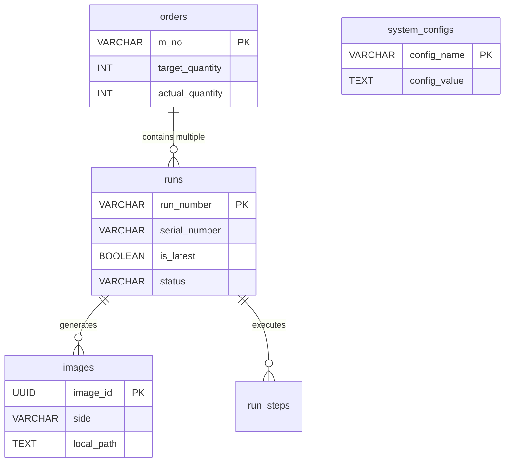

# NTUST AOI — Database Schema Documentation

The system uses **PostgreSQL** as the local database (Local DB) on the AOI machine to manage operations, coordinate state, and provide temporary storage before synchronizing data.

---

## 1. Table Details

### Table 1: `orders` (Order Management)

| Column | Data Type | Description |
| :--- | :--- | :--- |
| `m_no` **(PK)** | `VARCHAR(50)` | Unique Manufacturing Order number (e.g., `ORD-20240428-001`). |
| `target_quantity` | `INT` | Target number of PCBs to produce. |
| `actual_quantity` | `INT` | Actual number of PCBs inspected (Counted dynamically from `runs` where `is_latest = TRUE` and `status != 'PENDING'`). |
| `status` | `VARCHAR(20)` | Current state (`ACTIVE`, `COMPLETED`, `CANCELLED`). |
| `created_at` | `TIMESTAMP` | Timestamp when the order was created. |

---

### Table 2: `runs` (PCB Inspection Cycles)

| Column | Data Type | Description |
| :--- | :--- | :--- |
| `run_number` **(PK)** | `VARCHAR(50)` | Unique run ID (e.g., `RUN_20240428_114501`). |
| `serial_number` | `VARCHAR(50)` | Physical PCB Serial Number (S/N). |
| `semi_model` | `VARCHAR(100)` | Name/identifier of the AI/Inspection recipe model. |
| `m_no` **(FK)** | `VARCHAR(50)` | Reference to the `orders` table. |
| `machine_id` | `VARCHAR(50)` | ID of the AOI machine performing the test. |
| `status` | `VARCHAR(20)` | Run status (`PENDING`, `COMPLETED`, `PASS`, `FAIL`, `FAILED`). |
| `is_latest` | `BOOLEAN` | **Crucial:** `TRUE` if this is the most recent run for this S/N. If the S/N is rescanned, old runs are set to `FALSE` (Historical Data). |
| `start_time` | `TIMESTAMP` | Timestamp when the scan started. |
| `created_at` | `TIMESTAMP` | Timestamp when the run record was created. |

---

### Table 3: `images` (Detailed Inspection Images)

| Column | Data Type | Description |
| :--- | :--- | :--- |
| `image_id` **(PK)** | `UUID` | Unique identifier (automatically generated). |
| `run_number` **(FK)** | `VARCHAR(50)` | Link to the `runs` table. |
| `side` | `VARCHAR(10)` | Board surface (`Top` or `Bottom`). |
| `local_path` | `TEXT` | File path on the local AOI machine. |
| `longterm_path` | `TEXT` | File path/URL on the long-term archiving system. |
| `is_uploaded_longterm` | `BOOLEAN` | Default is `false`. Set to `true` after successful upload. |
| `row_idx` | `INTEGER` | Row position in the scanning grid. |
| `col_idx` | `INTEGER` | Column position in the scanning grid. |
| `condition` | `VARCHAR(10)` | Inspection result (`PASS`, `FAIL`). |
| `file_size_bytes` | `BIGINT` | Image file size in bytes. |
| `capture_time` | `TIMESTAMP` | Timestamp when the camera captured the image. |

---

### Table 4: `run_steps` (Step-by-step Execution Log)

| Column | Data Type | Description |
| :--- | :--- | :--- |
| `step_id` **(PK)**| `SERIAL` | Auto-incrementing step ID. |
| `run_number` **(FK)**| `VARCHAR(50)` | Link to the `runs` table. |
| `step_index` | `INT` | The sequence index of the step within the run. |
| `status` | `VARCHAR(20)` | Status of the step (`PENDING`, `COMPLETED`, `ERROR`). |
| `start_time` | `TIMESTAMP` | Step start time. |
| `end_time` | `TIMESTAMP` | Step completion time. |
| `payload_json` | `JSONB` | Additional step details (e.g., coordinates, configurations). |

---

### Table 5: `system_configs` (System States & Configurations)

| Column | Data Type | Description |
| :--- | :--- | :--- |
| `config_name` **(PK)** | `VARCHAR(100)` | Name of the configuration parameter (e.g., `plc_status`, `api_status`). |
| `config_value` | `TEXT` | Configured value (e.g., `OK`, `ERROR`). |
| `updated_at` | `TIMESTAMP` | Last time the configuration was updated. |

---

### Additional Logging Tables
- **`error_log`**: Tracks system and execution errors (`error_id`, `error_code`, `error_message`, `context_json`).
- **`external_lookup_log`**: Logs interactions with the external Shopfloor/MES system.

---

## 2. Entity-Relationship Diagram (ERD)

