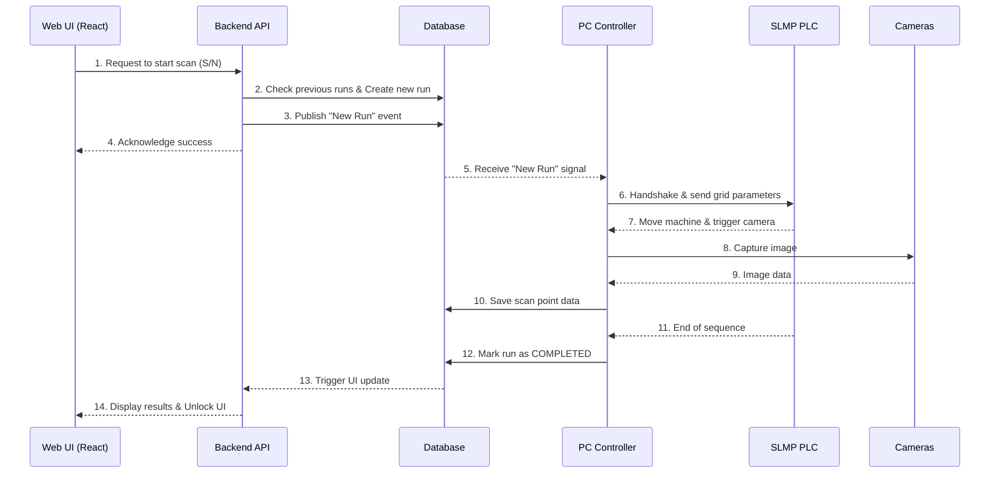
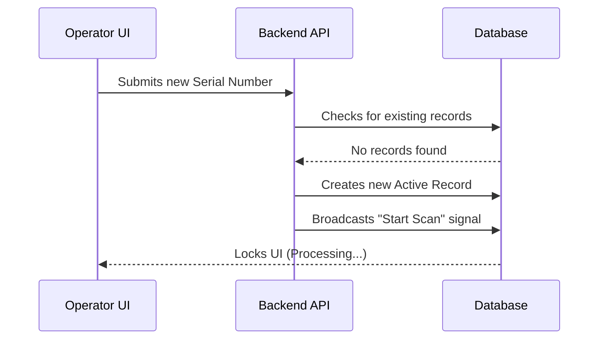
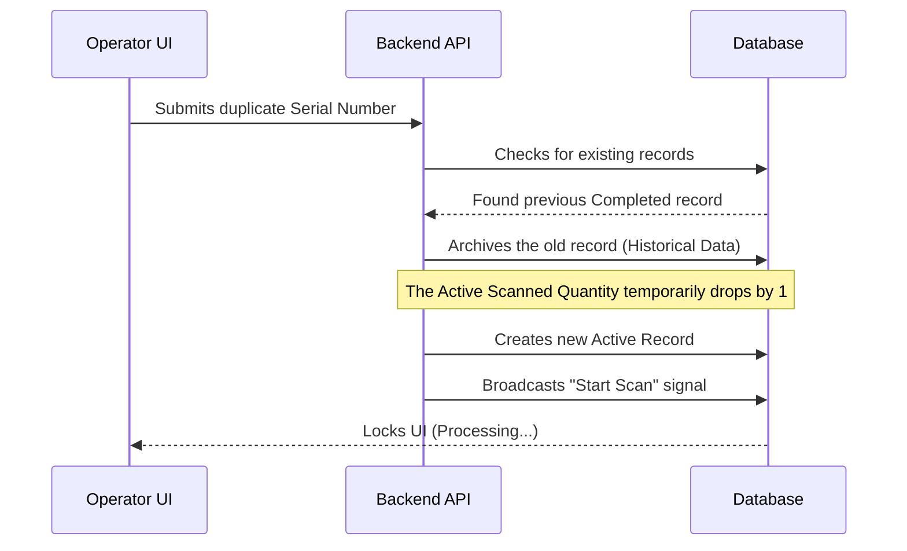
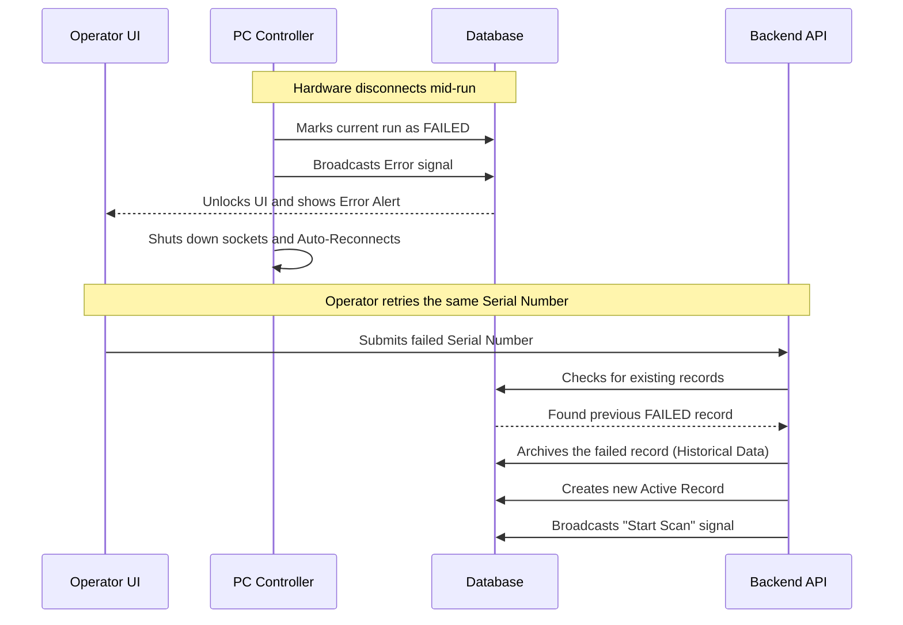

# AOI System Operational Workflows

This document outlines the detailed workflows for the NTUST AOI system during typical inspection cycles. The system uses a PostgreSQL database to track manufacturing orders, individual PCB scans (runs), and scan points.

---

## Overall System Architecture & Interaction

---

## 1. Normal Flow (New S/N Inspection)

**Scenario:** The operator inputs a brand new Serial Number (S/N) that has never been scanned before.

### Step-by-step Process:
1. **Input Phase:** The operator enters the S/N via the Web UI (Operator Dashboard) using a barcode scanner or manual entry.
2. **Pre-flight Check:** The UI calls `GET /system/status` to ensure the PLC, Shopfloor API, and Camera are all online. If any system is disconnected, the UI rejects the input immediately.
3. **Start Run (`POST /runs/start`):**
   - The backend checks the database for any previous runs associated with this S/N. Since it's new, no conflicts are found.
   - The backend creates a new entry in the `runs` table with:
     - `status = 'PENDING'`
     - `is_latest = TRUE`
   - The backend broadcasts a Postgres `NOTIFY` signal containing the S/N.
4. **Hardware Execution:**
   - The `pc_controller.py` service (which is constantly listening to the DB) receives the `NOTIFY` signal.
   - It transitions from `IDLE` to `SEMI_SELECT` and begins the inspection recipe, communicating with the PLC to move the machine and the Camera to capture images.
5. **Completion:**
   - Once all scan points are captured, the PLC sends a `RUN_COMPLETE` signal.
   - `pc_controller.py` updates the `runs` table, changing the status from `PENDING` to `COMPLETED` (or `PASS`/`FAIL` based on inference).
   - The system recounts the total `actual_quantity` for the Manufacturing Order by counting all runs where `is_latest = TRUE` and `status != 'PENDING'`.

---

## 2. Duplicate Flow (Re-scanning a Completed S/N)

**Scenario:** The operator inputs an S/N that has already been scanned and successfully completed (status `COMPLETED`, `PASS`, or `FAIL`).

### Step-by-step Process:
1. **Input & Validation:** The operator inputs the old S/N. The pre-flight check ensures the system is online.
2. **Start Run (`POST /runs/start`):**
   - The backend checks the database and discovers a previous run for this S/N.
   - It executes `check_and_invalidate_previous_runs`:
     - It finds the old run (e.g., status `COMPLETED`).
     - It updates the old run to set `is_latest = FALSE`. This preserves the historical data and images but removes it from the current active count.
   - The backend creates a **new** entry in the `runs` table with `status = 'PENDING'` and `is_latest = TRUE`.
   - The overall `actual_quantity` for the order temporarily decreases by 1 (since the old run is no longer `is_latest = TRUE`, and the new one is still `PENDING`).
3. **Hardware Execution:** The system executes the hardware scan as normal.
4. **Completion:**
   - Once the scan finishes, the new run is marked `COMPLETED`.
   - The `actual_quantity` for the order is recalculated, restoring the count to its correct value.
   - On the Gallery Dashboard, the old run will display a special "OLD DATA" badge to differentiate it from the current active run.

---

## 3. Recovery Flow (Re-scanning an Interrupted/Failed S/N)

**Scenario:** The system was scanning a PCB, but a critical failure occurred mid-run (e.g., the PLC lost power, the network cable was unplugged, or the application crashed). The operator must restart the scan for the same S/N.

### Step-by-step Process:
1. **Failure Detection & Auto-Recovery:**
   - If the PLC disconnects mid-run, `pc_controller.py` detects the lost connection (either via Socket `OSError` or the `IDLE` heartbeat).
   - `pc_controller.py` immediately updates the current run's status in the DB to `FAILED`.
   - It transitions to an `ERROR` state, gracefully shuts down camera and socket resources, waits 3 seconds, and re-initializes (`STARTUP`) to automatically restore the connection.
   - A WebSocket error event is fired to the Web UI, unlocking the operator dashboard so they can retry.
2. **Input Phase:** The operator enters the same S/N again.
3. **Start Run (`POST /runs/start`):**
   - The backend checks the database and finds the `FAILED` run.
   - Since `FAILED` is a terminal state (not `PENDING`), it treats it identically to a completed run: it sets `is_latest = FALSE` on the failed run to keep it as historical data.
   - A new run is created with `status = 'PENDING'` and `is_latest = TRUE`.
4. **Hardware Execution:** The inspection restarts from the beginning of the recipe for the new run.

*(Note: If a run was somehow completely stuck in a `PENDING` state due to a total power loss before it could be marked `FAILED`, the `POST /runs/start` endpoint will completely `DELETE` the old `PENDING` run from the database to prevent ghost data before starting the new run).*
