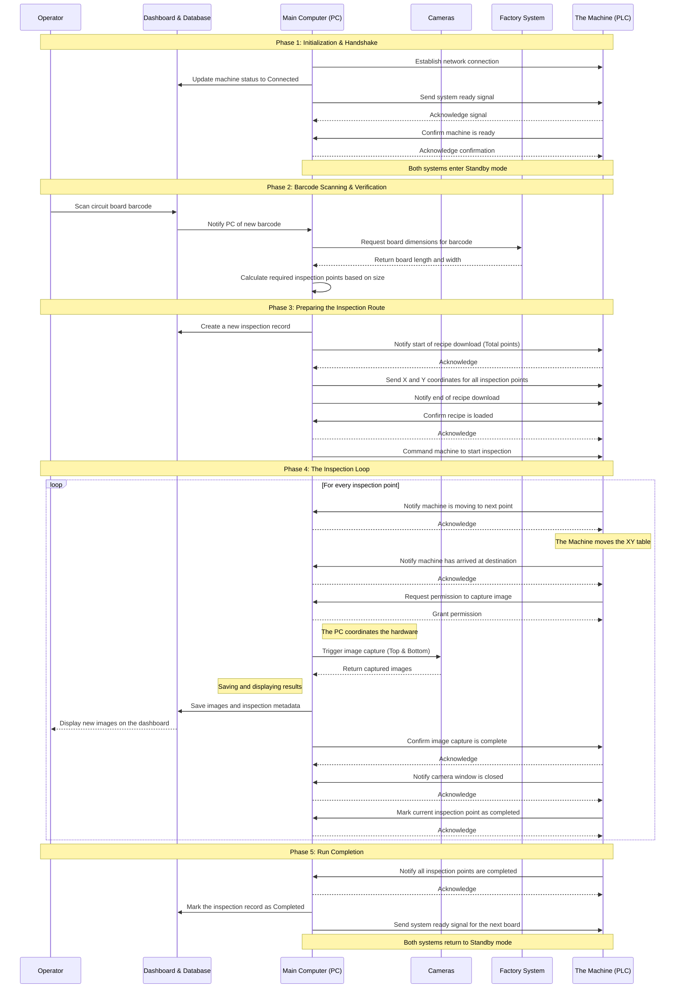

# AOI System Operational Workflow

This document outlines the operational sequences of the NTUST Automated Optical Inspection (AOI) system. It focuses on the logical steps and actions taken by each component, written in plain language for clarity.

## 1. System Components

The system consists of the following interacting nodes:
*   **The Machine (PLC)**: The physical robot that controls the XY Table, the conveyor belt, and the lighting.
*   **Main Computer (PC)**: The central processing unit. It coordinates the machine's movements, triggers the cameras, and processes data.
*   **Camera System**: Dual-camera setup (Top and Bottom) that takes high-resolution photos of the circuit boards.
*   **Factory System (MES)**: The external factory database that provides board dimensions based on the barcode.
*   **Database & Dashboard**: The local repository and user interface that stores inspection histories and displays live images.

---

## 2. Main Inspection Workflow

The following sequence diagram illustrates a complete inspection cycle, from startup to the completion of a board.

---

## 3. Synchronization Mechanism

To ensure the machine and the computer never lose synchronization, they rely on a strict handshake protocol:
*   **Event Polling**: The Main Computer continuously monitors the Machine's memory registers to detect new events or status changes.
*   **Acknowledgment (ACK)**: Every time the Machine sends an event (like "arrived at destination"), the Computer must send back an acknowledgment. The Machine will pause and wait indefinitely until it receives this acknowledgment, ensuring no step or photo is ever skipped.
*   **Safety Heartbeat**: Both the Machine and the Computer continuously exchange a heartbeat signal. If the connection is lost or unplugged, the heartbeat stops, and the Machine automatically locks its motors within 5 seconds to prevent accidents.
