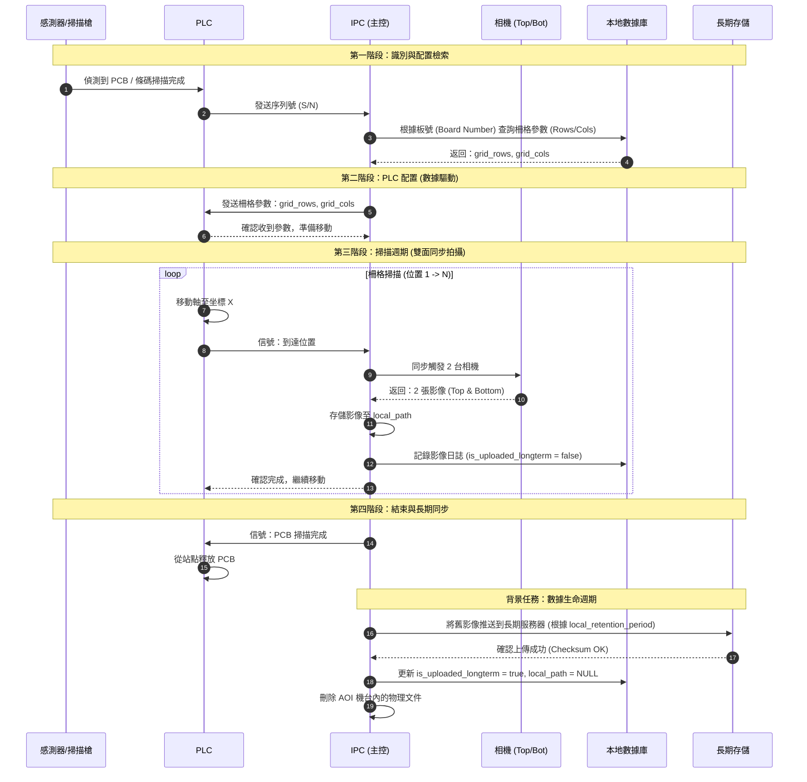

# AOI 系統架構與運行流程 (IPC 主控)

[TOC]

---

## 1. 系統概覽 (System Overview)

在此架構中，**IPC (工業電腦)** 扮演主控制器 (Master Controller) 的角色。所有運行順序，從啟動、產品檢測到數據生命週期管理，均由 IPC 協調。

### 核心組件：
1.  **IPC (Master)**: 運行主控制程序、影像處理與數據庫管理。
2.  **Local DB (PostgreSQL)**: 本地存儲訂單信息、掃描結果與配置。
3.  **Longterm Storage (MinIO/Server)**: 長期存儲系統，用於存儲壓縮後的影像或歷史記錄。
4.  **Hardware**: PLC (機構控制)、2 台相機 (Top/Bottom)、掃描槍 (Barcode)。

---

## 2. 詳細運行流程 (Operation Workflow)

下圖描述了電路板 (PCB) 進入檢測站時的順序，採用 **數據驅動 (Data-driven)** 機制（IPC 直接向 PLC 發送掃描柵格參數）。

---

## 3. 詳細執行步驟

### 步驟 1：產品識別與配置獲取
- 當感測器偵測到 PCB 時，掃描槍讀取 S/N。
- IPC 接收 S/N，查詢對應的 `Board Number` 與 `Order Number`。
- IPC 從本地數據庫的 `board_numbers` 表中獲取掃描柵格參數 `grid_rows` 與 `grid_cols`。

### 步驟 2：PLC 控制 (Data-driven Approach)
- IPC 不再由 PLC 選擇固定的程序，而是直接將 `grid_rows` 與 `grid_cols` 參數寫入 PLC 的暫存器 (Registers)。
- 這使得 AOI 系統無需修改 PLC/HMI 代碼即可支持新型號電路板。

### 步驟 3：檢測週期 (Dual Camera Capture)
- PLC 根據掃描柵格移動各軸。在每個停頓點，PLC 向 IPC 發送信號。
- IPC 同步觸發 2 台相機（頂部和底部）。
- 影像存儲在 AOI 機台 SSD 的本地路徑 (`local_path`)，以確保 UI 顯示速度最快。
- 在 `images` 表中創建記錄，狀態為 `is_uploaded_longterm = false`。

### 步驟 4：數據生命週期管理 (Data Lifecycle)
- **同步**：背景進程將檢查存放時間超過 `local_retention_period`（在 `system_configs` 表中配置）的影像。
- **驗證**：IPC 將影像推送到長期存儲服務器 (Longterm Storage)。此過程必須包含 **校驗和 (Checksum, MD5/SHA)** 步驟，以確保文件傳輸正確。
- **清理**：收到長期存儲服務器的成功信號後，IPC 將：
    1. 更新 `is_uploaded_longterm = true`。
    2. 在 `longterm_path` 中保存新路徑。
    3. 刪除 AOI 機台的影像文件，並將 `local_path` 設為 `NULL` 以釋放 SSD 空間。

---

## 4. 命名規則與目錄結構
- **本地路徑 (Local Path)**: `D:/Images/Order_Number/SN/Side/Row_Col.jpg`
- **長期路徑 (Longterm Path)**: `http://storage-server:9000/archive/Order_Number/SN/Side/Row_Col.jpg`
- **狀態約定**:
    - `is_synced_server`: 上傳文字結果至工廠系統的狀態。
    - `is_uploaded_longterm`: 上傳影像文件至長期存儲系統的狀態。
