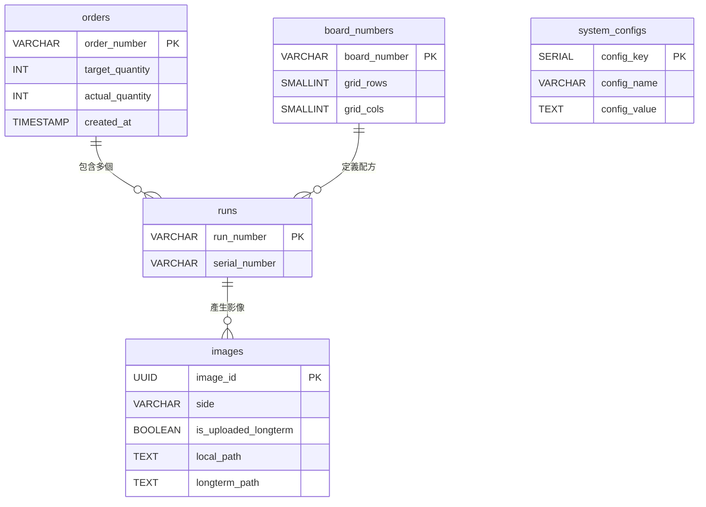

# NTUST AOI — 數據庫架構文檔 (Database Schema)

系統採用 **PostgreSQL** 作為 AOI 機台的本地數據庫 (Local DB)，用於管理運行數據並在同步到長期存儲系統 (Longterm Storage) 之前進行臨時存儲。

---

## 業務邏輯分析 (雙相機同步拍攝)

```
訂單 (Order Number)
└── 每一片通過的 PCB (Serial Number)
    └── 一次檢測掃描 (Run Number)
        └── 由 2 台相機產生的影像 (Top & Bottom)
```

---

## 數據表詳情

### 表 1：`orders` (訂單管理)

| 欄位 | 數據類型 | 描述 |
| :--- | :--- | :--- |
| `order_number` **(PK)** | `VARCHAR(50)` | 訂單編號 (例如：`ORD-20240428-001`)。 |
| `target_quantity` | `INT` | 計劃生產數量。 |
| `actual_quantity` | `INT` | 實際已掃描完成的數量 (統計自 `runs` 表)。 |
| `status` | `VARCHAR(20)` | 狀態 (`ACTIVE`, `COMPLETED`, `CANCELLED`)。 |
| `created_at` | `TIMESTAMP` | **系統創建訂單記錄的時間。** |

---

### 表 2：`board_numbers` (板別配方 - Recipe)

| 欄位 | 數據類型 | 描述 |
| :--- | :--- | :--- |
| `board_number` **(PK)** | `VARCHAR(30)` | 板別代號 (例如：`BN-5X5`, `BN-7X7`)。 |
| `grid_rows` | `SMALLINT` | 掃描柵格的行數 (發送至 PLC)。 |
| `grid_cols` | `SMALLINT` | 掃描柵格的列數 (發送至 PLC)。 |
| `created_at` | `TIMESTAMP` | 板別創建時間。 |

---

### 表 3：`runs` (PCB 檢測批次)

| 欄位 | 數據類型 | 描述 |
| :--- | :--- | :--- |
| `run_number` **(PK)** | `VARCHAR(50)` | 運行編號 (例如：`RUN_20240428_114501`)。 |
| `serial_number` | `VARCHAR(50)` | 物理 PCB 的序號 (S/N)。 |
| `board_number` **(FK)** | `VARCHAR(30)` | 關聯至 `board_numbers`。 |
| `order_number` **(FK)** | `VARCHAR(50)` | 關聯至 `orders`。 |
| `machine_id` | `VARCHAR(50)` | 執行檢測的機台 ID。 |
| `status` | `VARCHAR(20)` | 狀態 (`COMPLETED`, `PENDING`)。 |
| `start_time` | `TIMESTAMP` | 開始掃描時間。 |
| `created_at` | `TIMESTAMP` | 創建運行記錄的時間。 |

---

### 表 4：`images` (影像詳情 - 雙相機)

| 欄位 | 數據類型 | 描述 |
| :--- | :--- | :--- |
| `image_id` **(PK)** | `UUID` | 唯一識別 ID (自動生成)。 |
| `run_number` **(FK)** | `VARCHAR(50)` | 關聯至 `runs` 表。 |
| `side` | `VARCHAR(10)` | 板面 (`Top` 或 `Bottom`)。 |
| `local_path` | `TEXT` | AOI 機台內的影像路徑。上傳至長期服務器後將被刪除 (NULL)。 |
| `longterm_path` | `TEXT` | 長期存儲服務器 (Longterm Storage) 上的影像路徑。 |
| `is_uploaded_longterm` | `BOOLEAN` | 預設為 `false`。上傳成功後變更為 `true`。 |
| `row_idx` | `INTEGER` | 柵格中的行位置。 |
| `col_idx` | `INTEGER` | 柵格中的列位置。 |
| `condition` | `VARCHAR(10)` | 結果 (`PASS`, `FAIL`)。 |
| `file_size_bytes` | `BIGINT` | 影像文件大小。 |
| `capture_time` | `TIMESTAMP` | 相機拍攝此張影像的時間。 |

---

### 表 5：`system_configs` (系統配置)

| 欄位 | 數據類型 | 描述 |
| :--- | :--- | :--- |
| **`config_key` (PK)** | `SERIAL` | 自動遞增的主鍵。 |
| `config_name` | `VARCHAR(100)` | 配置參數名稱。 |
| `config_value` | `TEXT` | 設置值。 |
| `unit` | `VARCHAR(20)` | 計算單位 (分鐘, 天, %)。 |

**核心配置參數：**
1.  **`local_retention_period`**: 影像在本地機台保留的時間，超過後將推送到長期服務器 (例如：`30` 單位 `天`)。
2.  **`sync_retry_interval`**: 上傳長期服務器失敗後的重試間隔 (例如：`5` 單位 `分鐘`)。

---

## 關係圖 (ERD)



---

## 存儲規則與命名約定 (Naming Convention)

為確保系統化與易於檢索，目錄結構與文件命名規定如下：

- **本地存儲 (Local Storage)**: `{local_root}/{order_number}/{serial_number}/{side}/{row}_{col}.jpg`
- **長期存儲 (Longterm Storage)**: `{longterm_root}/{order_number}/{serial_number}/{side}/{row}_{col}.jpg`

**示例：**
- AOI 機台: `D:/Images/ORD-001/SN-999/Top/1_1.jpg`
- 長期服務器: `http://192.168.40.21:9000/archive/ORD-001/SN-999/Top/1_1.jpg`
