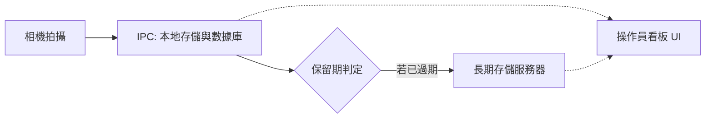

# AOI 系統：數據生命週期與同步流程 (Data Flow)

本文件描述了檢測影像與元數據 (Metadata) 如何被捕捉、存儲在本地，並最終同步到長期存儲系統，同時保持操作員可隨時訪問的高層級流程。

---

## 1. 簡化數據流圖 (Simplified Data Flow)

---

## 2. 流程摘要 (Process Summary)

1.  **捕捉 (Capture)**：相機拍攝照片並將其保存到 **IPC**（工業電腦）的本地磁碟與數據庫中。
2.  **存儲 (Storage)**：照片保留在 IPC 中一段設定好的時間（例如：30 天），以便快速訪問與查看。
3.  **歸檔 (Archive)**：超過設定時間後，照片會自動移動到 **長期存儲服務器**，以釋放 IPC 的磁碟空間。
4.  **查看 (View)**：無論照片是存在 IPC 還是長期服務器中，**操作員看板 (Dashboard)** 都能透明地顯示影像，無需手動切換。
